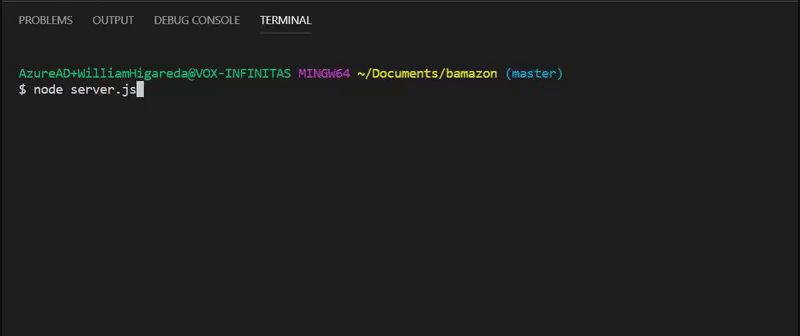
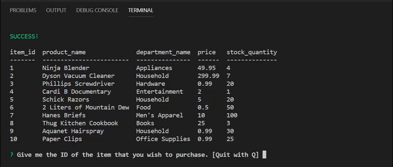
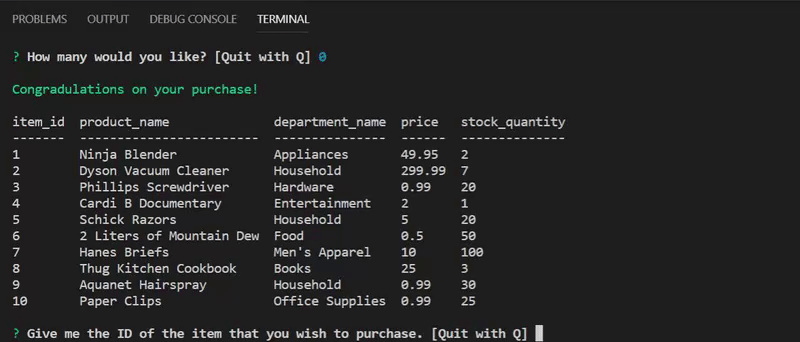
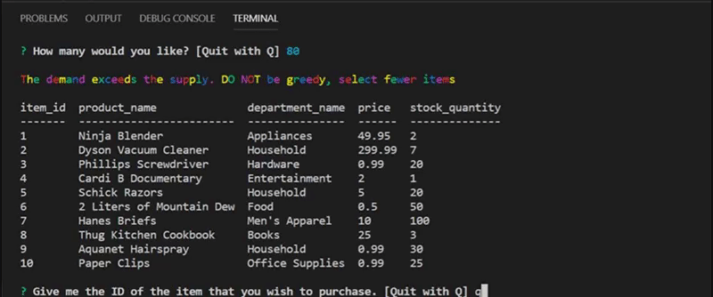

## Getting Started

- Clone repo.
- Run command in Terminal or Gitbash 'npm init'
- Run commands to install inquirer & mySQL 'npm install inquirer' & 'npm install mysql'
- Run 'Q' to quit

### What The App Does

 `BamazonCustomer.js`

    * Prints the products in the store.

    * Prompts customer which product they would like to purchase by ID number.

    * Asks for the quantity.

      * If there is a sufficient amount of the product in stock, it will return the total for that purchase.
      * However, if there is not enough of the product in stock, it will tell the user that there isn't enough of the product.
      * If the purchase goes through, it updates the stock quantity to reflect the purchase.
    

#### Examples: 

`Connecting to the SQL/Database to Load Table`

`Successful Purchase`

`Purchasing more items than available`

`Quit Bamazon`
